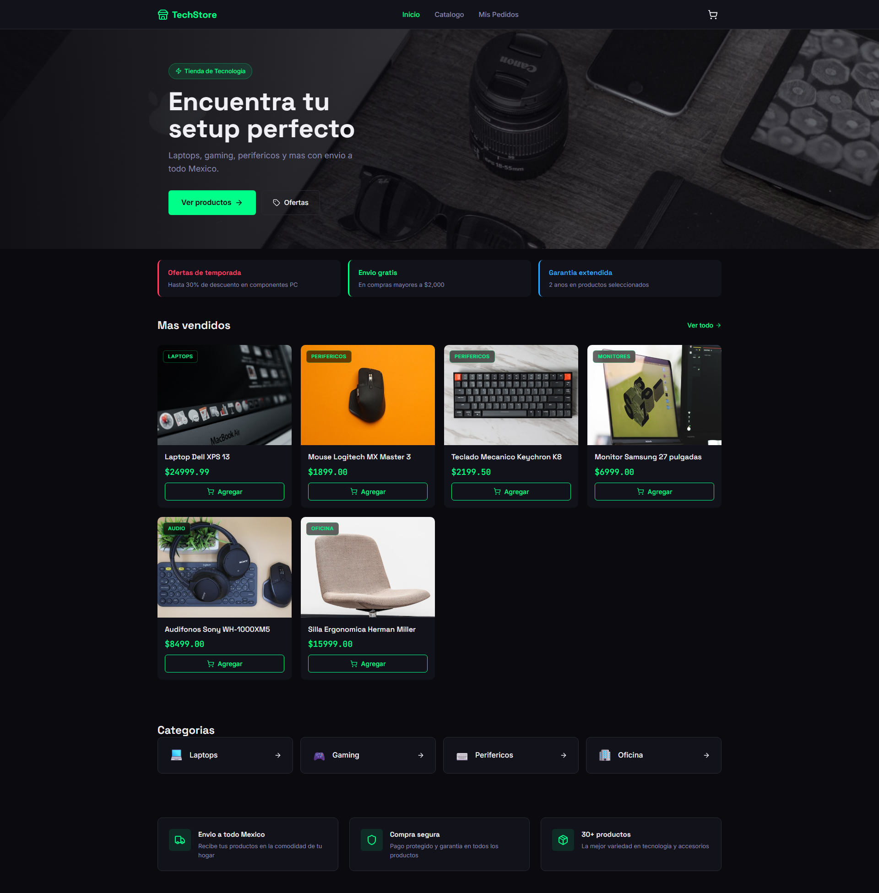
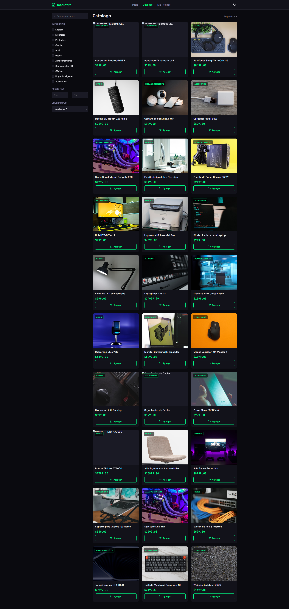
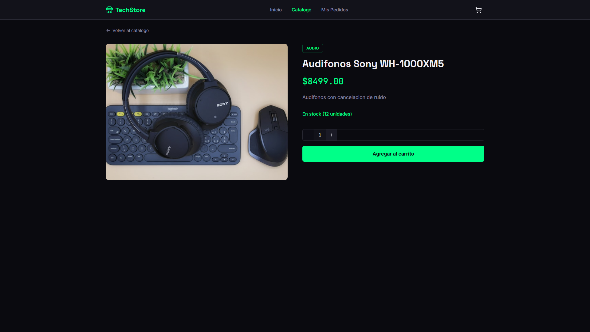
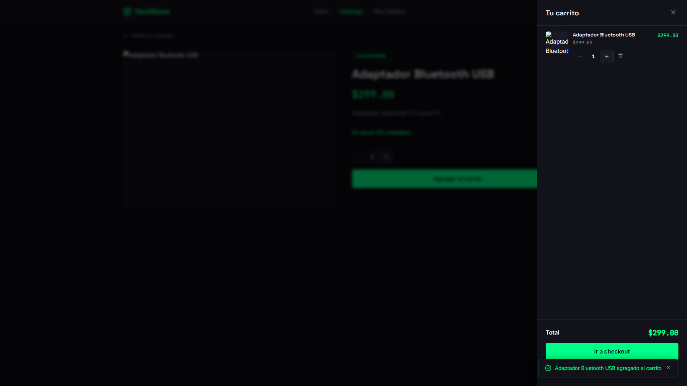
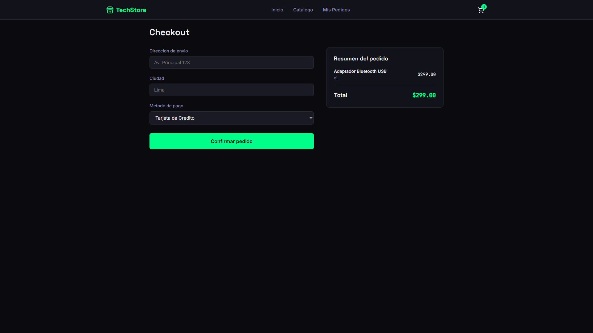
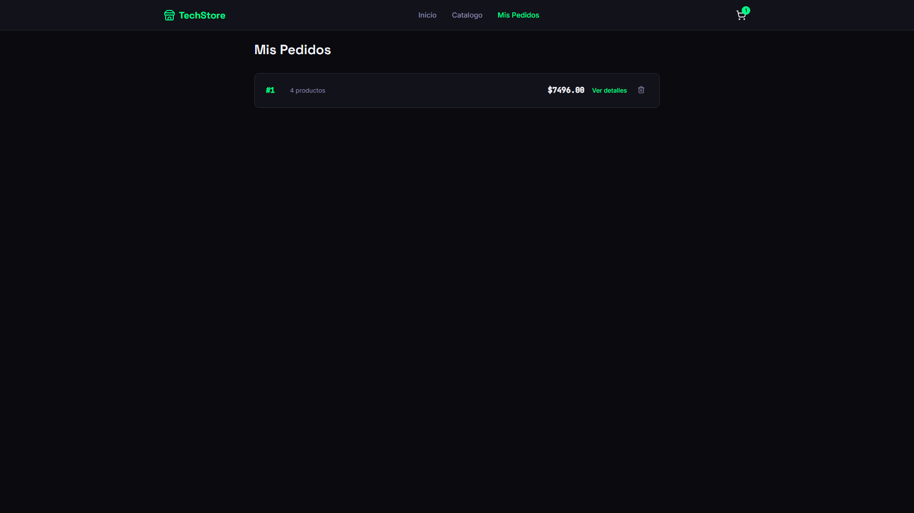
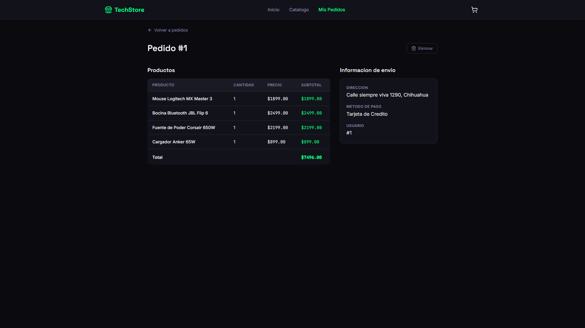

# E-Commerce Microservices

Arquitectura de microservicios para una plataforma e-commerce construida con **Spring Boot**, **Spring Cloud** y un frontend en **React**.

---

## Arquitectura del Sistema

```
                        ┌──────────────────────┐
                        │    Eureka Server      │
                        │      :8761            │
                        │  Service Registry     │
                        └──────────┬────────────┘
             ┌─────────────────────┼─────────────────────┐
             │                     │                     │
   ┌─────────┴──────────┐  ┌──────┴──────────────────┐  │
   │   API Gateway       │  │  Product Microservice   │  │
   │      :8080          │  │      :8081              │  │
   │  "api-gateweay"     │  │  "product-microservice" │  │
   └─────────┬──────────┘  └──────────┬──────────────┘  │
             │                         │                  │
             │  lb://PRODUCT-          │  Feign Client   │
             │  MICROSERVICE           │  (REST)         │
             │────────────────────────>│                  │
             │                         │                  │
             │  lb://ORDER-      ┌─────┴──────────────┐  │
             │  MICROSERVICE     │  Order Microservice │  │
             │──────────────────>│      :8082          │  │
Frontend  │  /products/**       │  "order-microservice"│  │
React ────┘  /orders/**         └──────────┬───────────┘  │
:3000                                       │
                                             │  Publica evento
                                             ▼
                                  ┌─────────────────────┐
                                  │    Amazon SNS        │
                                  │  order-created-topic │
                                  └──────────┬───────────┘
                                             │  Invoca
                                             ▼
                                  ┌─────────────────────┐
                                  │    AWS Lambda         │
                                  │ notify-order-created  │
                                  │ (Spring Cloud Function)│
                                  └─────────────────────┘
```

---

## Microservicios

### 1. Eureka Service (Service Registry)

|                 |                                                        |
| --------------- | ------------------------------------------------------ |
| **Puerto**      | `8761`                                                 |
| **Nombre**      | `eureka-service`                                       |
| **Descripcion** | Servidor de descubrimiento de servicios Netflix Eureka |

### 2. API Gateway

|               |                                         |
| ------------- | --------------------------------------- |
| **Puerto**    | `8080`                                  |
| **Nombre**    | `api-gateweay`                          |
| **Framework** | Spring Cloud Gateway (WebFlux/Reactivo) |

**Rutas:**

| Ruta           | Destino                     |
| -------------- | --------------------------- |
| `/products/**` | `lb://PRODUCT-MICROSERVICE` |
| `/orders/**`   | `lb://ORDER-MICROSERVICE`   |

### 3. Product Microservice

|                   |                         |
| ----------------- | ----------------------- |
| **Puerto**        | `8081`                  |
| **Base de datos** | PostgreSQL `product_db` |

| Metodo | Path                 | Descripcion                 |
| ------ | --------------------- | --------------------------- |
| `GET`  | `/api/products`      | Obtener todos los productos |
| `GET`  | `/api/products/{id}` | Obtener producto por ID     |
| `POST` | `/api/products`      | Crear productos (bulk)      |

**Autenticacion (Spring Security + JWT):**

| Ruta             | Metodo | Acceso                     |
| ----------------- | ------ | --------------------------- |
| `/api/products`   | `GET`  | Publico (catalogo abierto) |
| `/api/products`   | `POST` | Requiere JWT (rol ADMIN)   |
| `/auth/login`     | `POST` | Publico (login)            |

### 4. Order Microservice

|                   |                                       |
| ----------------- | -------------------------------------- |
| **Puerto**        | `8082`                                |
| **Base de datos** | PostgreSQL `order_db`                 |
| **Comunicacion**  | Feign Client con Product Microservice |

| Metodo   | Path               | Descripcion               |
| -------- | ------------------ | -------------------------- |
| `GET`    | `/api/orders`      | Obtener todas las ordenes |
| `GET`    | `/api/orders/{id}` | Obtener orden por ID      |
| `POST`   | `/api/orders`      | Crear orden               |
| `PUT`    | `/api/orders`      | Actualizar orden          |
| `DELETE` | `/api/orders/{id}` | Eliminar orden            |

Al crear una orden exitosamente, se publica un evento a **Amazon SNS**, que dispara una funcion **AWS Lambda** para procesar la notificacion de forma asincrona (ver seccion [Notificaciones con AWS Lambda + SNS](#notificaciones-con-aws-lambda--sns)).

### 5. Frontend (React)

|               |                                              |
| ------------- | -------------------------------------------- |
| **Puerto**    | `3000`                                       |
| **Framework** | React 18 + Vite                              |
| **Estilo**    | Dark Tech Theme (#0A0A0F bg, #00FF88 accent) |

**Paginas:**

- `/` - Home con banner, productos destacados, categorias
- `/products` - Catalogo con filtros (busqueda, categoria, precio, orden)
- `/products/:id` - Detalle de producto
- `/checkout` - Formulario de compra
- `/orders` - Historial de pedidos
- `/orders/:id` - Detalle de pedido

**Features:**

- Carrito persistente (localStorage)
- Toasts de notificacion
- Responsive (mobile/tablet/desktop)
- Skeletons de carga
- Estados vacios con CTA

### Capturas de Pantalla

**1. Página Principal (Home)**
[](captures/01_home.png)

**2. Catálogo de Productos**
[](captures/02_catalog.png)

**3. Detalle de Producto**
[](captures/03_product_detail.png)

**4. Carrito de Compras**
[](captures/04_cart_drawer.png)

**5. Checkout**
[](captures/05_checkout.png)

**6. Historial de Pedidos**
[](captures/06_order_history.png)

**7. Detalle de Pedido**
[](captures/07_order_detail.png)

**8. Logs de AWS Lambda en CloudWatch**
[](captures/08_lambda_logs.png)
*Captura pendiente: agregar screenshot de `aws logs tail /aws/lambda/notify-order-created` mostrando una invocacion exitosa.*

---

## Comunicacion entre Microservicios

```
Order Service ──Feign──→ Product Service ──→ product_db
     │                        │
     │  GET /api/products/1   │
     │←──── { price: 24999 } ─│
     │
     └──→ Crea OrderItem con precio actual
```

**Ejemplo de request para crear orden:**

```
POST http://localhost:8080/orders
{
  "userId": 1,
  "customerEmail": "cliente@ejemplo.com",
  "shippingAddress": "Av. Universidad 123, Chihuahua",
  "paymentMethod": "CREDIT_CARD",
  "items": [
    { "productId": 1, "quantity": 1 },
    { "productId": 5, "quantity": 2 }
  ]
}
```

---

## Notificaciones con AWS Lambda + SNS

Cuando se crea una orden, `Order Microservice` publica un evento a **Amazon SNS**, que a su vez invoca una funcion **AWS Lambda** (construida con Spring Cloud Function) para procesar la notificacion de forma asincrona y desacoplada del flujo principal.

**Flujo:**

```
Order Microservice ──publish──→ Amazon SNS ──invoke──→ AWS Lambda
   (guarda orden)      (order-created-topic)      (notify-order-created)
```

**Por que este patron:**

- El microservicio de ordenes no depende de que el envio de notificacion sea exitoso para responder al usuario
- Si en el futuro se agregan mas consumidores (actualizar inventario, facturacion, etc.), se suscriben al mismo topico sin tocar `Order Microservice`
- La funcion Lambda escala automaticamente y solo genera costo cuando se ejecuta (pago por uso)

**Componentes:**

| Componente               | Descripcion                                                                |
| ------------------------- | --------------------------------------------------------------------------- |
| `NotificationPublisher`  | Servicio en `order-microservice` que publica el evento a SNS usando AWS SDK v2 |
| `order-created-topic`    | Topico de Amazon SNS que distribuye el evento                              |
| `notify-order-created`   | Funcion Lambda (Java 17 + Spring Cloud Function) suscrita al topico        |

**Ejemplo de evento publicado:**

```json
{
  "orderId": 27,
  "customerEmail": "cliente@ejemplo.com"
}
```

---

## Docker (Recomendado)

### Ejecutar con Docker Compose

```
docker-compose up --build
```

### Urls despues de levantar:

| Servicio         | URL                                  |
| ----------------- | ------------------------------------- |
| Frontend         | <http://localhost:3000>              |
| Gateway          | <http://localhost:8080>              |
| Eureka Dashboard | <http://localhost:8761>              |
| Product API      | <http://localhost:8081/api/products> |
| Order API        | <http://localhost:8082/api/orders>   |

### Comandos utiles:

```
# Ejecutar en background
docker-compose up --build -d

# Ver logs
docker-compose logs -f

# Detener todo
docker-compose down

# Limpiar volumes
docker-compose down -v
```

---

## Ejecutar sin Docker

### Requisitos Previos

- **Java 17+**
- **Maven 3.6+**
- **PostgreSQL 12+**
- **Node.js 18+** (para frontend)
- **Puertos:** 8761, 8080, 8081, 8082, 3000, 5432

### Base de Datos

```
CREATE DATABASE product_db;
CREATE DATABASE order_db;
```

Credenciales: postgres / postgres

### 1. Iniciar Eureka Server (Primero)

```
cd eureka-service/eureka-service
mvn spring-boot:run
```

### 2. Iniciar Product Microservice

```
cd product-microservice
mvn spring-boot:run
```

### 3. Iniciar Order Microservice

```
cd order-microservice
mvn spring-boot:run
```

### 4. Iniciar API Gateway

```
cd ecomerse-gateweay
mvn spring-boot:run
```

### 5. Iniciar Frontend

```
cd frontend
npm install
npm run dev
```

---

## Stack Tecnologico

| Componente         | Tecnologia                       |
| -------------------- | ---------------------------------- |
| Backend             | Java 17, Spring Boot 4.1.1        |
| Cloud               | Spring Cloud 2025.1.3             |
| Service Discovery   | Netflix Eureka                    |
| API Gateway         | Spring Cloud Gateway (WebFlux)    |
| Comunicacion        | Spring Cloud OpenFeign            |
| Seguridad           | Spring Security, JWT (JJWT)       |
| Mensajeria          | Amazon SNS                        |
| Serverless          | AWS Lambda, Spring Cloud Function |
| ORM                 | Spring Data JPA / Hibernate       |
| Base de datos       | PostgreSQL                        |
| Frontend            | React 18, Vite, React Router v6   |
| Contenedores        | Docker, Docker Compose            |
| Cloud (Despliegue)  | AWS EC2                           |

---

## Estructura del Proyecto

```
e-commerce-microservice/
├── docker-compose.yml
├── init-db.sql
├── eureka-service/
│   └── eureka-service/
├── ecomerse-gateweay/
├── product-microservice/
│   └── security/          (JWT, Spring Security)
├── order-microservice/
│   └── service/           (NotificationPublisher → SNS)
├── aws-lambda-demo/        (Funcion Lambda con Spring Cloud Function)
└── frontend/
    ├── src/
    │   ├── components/    (Navbar, ProductCard, CartDrawer, etc.)
    │   ├── pages/         (Home, Catalog, ProductDetail, Checkout, etc.)
    │   ├── context/       (CartContext)
    │   └── api/           (client.js)
    └── nginx.conf
```

---

## Licencia

